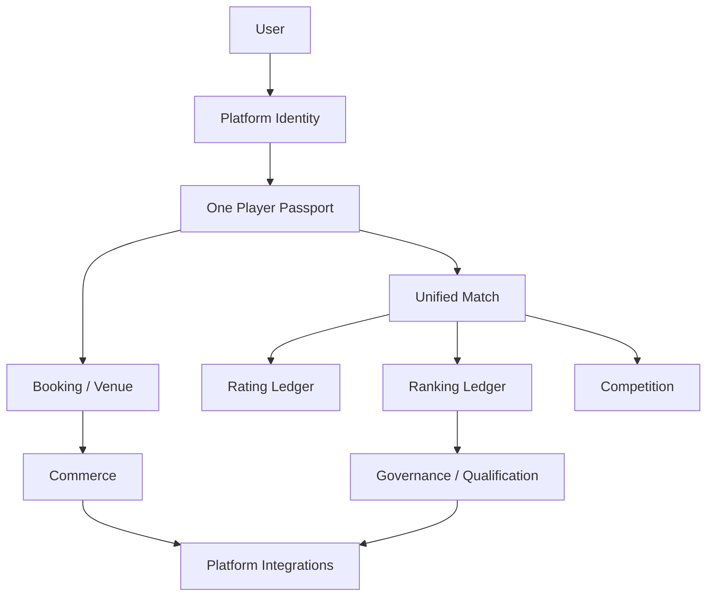
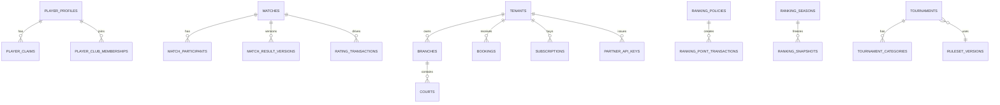

# Pickleball Platform — Architecture Review

Ngày review: 09/08/2026  
Runtime thực tế: CodeIgniter 4.7.3, PHP 8.2, MySQL 8, server-rendered admin/player UI, REST API, database queue.

> Master prompt tham chiếu Laravel 11/PHP 8.3. Repository hiện tại là CodeIgniter 4; review này giữ stack đang chạy và áp dụng nguyên tắc modular monolith, không rewrite sang framework khác.

## 1. Executive architecture summary

Nền tảng hiện đã có lõi Booking SaaS, Tournament SaaS, Player Passport, Unified Match, Rating/Ranking ledger, Governance, Public Portal và Partner API. Kiến trúc đúng hướng nhất hiện nay là mở rộng các nguồn sự thật hiện hữu, sau đó tách ranh giới domain bằng service, policy, event và queue.

Mục tiêu target:



Không được để UI/controller tự tính rating, ranking, availability hoặc eligibility. Các nghiệp vụ đó phải đi qua domain service có transaction, policy version và audit.

## 2. Current system map

| Area | Hiện trạng | Đánh giá | Quyết định |
|---|---|---|---|
| Auth/RBAC | users, roles, permissions, auth filter | EXISTS | REUSE/EXTEND |
| Tenant | tenants, branches, facilities, tenant filters | EXISTS/PARTIAL | REUSE, harden membership |
| Player | players + player competitive profile/passport | PARTIAL | EXTEND global identity |
| Booking | booking service, availability, waitlist, recurring, walk-in | EXISTS | REUSE, extract availability boundary |
| Venue | facilities, branches, courts, maintenance | EXISTS | REUSE, add timezone/address model |
| Club | tenant clubs + platform clubs/aliases | PARTIAL | Keep operational and network identities separate |
| Match | unified matches + tournament adapter | EXISTS/PARTIAL | Make unified match canonical for competitive data |
| Tournament | categories, registration, scheduler, live score, check-in | PARTIAL | Add ruleset/draw/seeding versioning |
| Rating | legacy player ratings + canonical V1 engine/ledger | PARTIAL/DUPLICATED | Canonicalize, preserve legacy read adapter |
| Ranking | authority/policy/point ledger/snapshot | PARTIAL | Add country/discipline/season dimensions |
| Governance | sanctions, disputes, qualification foundations | PARTIAL | Complete appeals/integrity workflow |
| Commerce | invoices, payments, wallet, POS, plans | EXISTS/PARTIAL | Add currency/price/subscription boundaries |
| Integration | jobs, notifications, webhooks, partner API | PARTIAL | Add event/outbox, connector contract, import pipeline |
| Public API | public/partner/internal routes | PARTIAL | Publish versioned OpenAPI contract |
| Search/cache | MySQL queries, no abstraction | MISSING | Create provider interface first |
| Observability | application logs/audit | PARTIAL | Add metrics and request correlation |

## 3. Target domain boundaries

1. Identity: user, player passport, claims, merge, coach/referee profiles.
2. Venue & Club: organization, venue, branch, court, club network, location.
3. Booking: availability, holds, booking state, check-in, waitlist, coach/open-play booking.
4. Community & Match: recreational/community match, unified match, participants, scores, result versions.
5. Competition: tournament/league, category, ruleset, eligibility, draw, scheduling, live score.
6. Rating: provider, rating profile, transaction ledger, reliability, skill, integrity signal.
7. Ranking: authority, policy, season, points ledger, snapshot, leaderboard.
8. Governance: sanctioning, result authority, disputes, appeals, sanctions, integrity cases.
9. Commerce: catalog, plans, entitlements, subscriptions, invoices, payments, wallet, POS.
10. Platform & Integration: API gateway, keys, webhooks, connectors, import, notifications, audit, metrics.

## 4. Duplicated responsibilities to remove gradually

| Duplication | Canonical target | Migration rule |
|---|---|---|
| `players.rating_score` / `player_statistics` vs rating V1 | Rating profile + ledger | Read adapter first; stop new writes to legacy columns |
| `tournament_matches` vs `matches` | `matches` + source reference | Tournament adapter remains write bridge until parity is proven |
| tenant `clubs` vs `platform_clubs` | Operational club + network club alias | Never expose operational financial data through network API |
| direct controller SQL vs services | Domain service/repository | New writes must use service; refactor hot paths incrementally |
| bearer token vs partner API key | Separate internal and partner auth | Do not make internal admin token public |
| notification jobs vs webhook jobs | Queue categories + job contract | Preserve JobModel while adding typed payload/idempotency |

## 5. Missing core components

- organization membership across multiple organizations/branches;
- canonical country/region/city/address and IANA venue timezone;
- ruleset and ruleset version linked to every competition/result;
- complete import pipeline: upload → map → validate → identity resolution → preview → approve → commit;
- generic `IntegrationProvider` contract and consent/connection state;
- outbox/domain event registry and queue isolation;
- appeal and integrity case workflows;
- data provenance on official result/rating/ranking transactions;
- multi-currency price/subscription snapshots;
- request ID, metrics and searchable operational health;
- full OpenAPI YAML generated/validated in CI.

## 6. Player identity model

`users` is authentication. `players` is the tenant operational projection. `player_competitive_profiles` is the platform passport and owns the public National Player ID. Claims and merge audit preserve identity history. A player may have many tenant club memberships but only one canonical platform passport.

Import resolution order:

```text
National Player ID → exact
provider + external ID → exact
verified phone/email → possible exact
name + location → suggestion only
```

Merge is append-only: source player becomes `merged`, references are redirected, original ID and audit remain queryable.

## 7. Organization and tenancy model

```text
Organization/Tenant
├── Venues / Facilities
│   └── Branches
│       └── Courts
├── Staff / Organization memberships
├── Operational clubs
├── Tournaments
└── Subscription / Entitlements

Platform Club Network
└── aliases → tenant operational clubs
```

Tenant-private: customers, bookings, payments, notes, staff operations. Platform-public: verified passport, official result, public ranking, verified club and published event.

## 8. Match data model

```text
matches
├── match_participants
├── match_teams (future normalized extension)
├── match_games
├── match_results
└── match_result_versions
```

`source_type/source_id` identifies recreational, open-play, club, league or tournament origin. Result state is versioned and only `official` can trigger rating/ranking consumers.

## 9. Competition model

Competition is the generic domain; Tournament is one type. Category dimensions are data, not code branches. Each event must eventually point to `ruleset_id`, `ruleset_version_id`, tier, authority/sanction and draw version. Scheduler enforces hard constraints and treats court utilization/wait time as soft objectives.

## 10. Rating model

Rating and skill are separate. Provider abstraction supports internal and external ratings without overwriting internal values. Every transaction stores before/after/delta, provider, policy version, source match/result version, reason and provenance. Rebuild must be deterministic and dry-run capable.

## 11. Ranking model

Ranking is computed from point transactions, not directly from rating. Authority, policy, discipline, season, country and scope are explicit dimensions. Snapshots are the read model for historical rank and movers; leaderboard page reads snapshot/cache, not an unbounded match scan.

## 12. Governance model

Governance owns sanction, official-result authority, dispute, appeal, disciplinary status and integrity review. Heuristics create review cases; they never auto-convict or auto-ban. Result correction creates compensation/rebuild work, never deletes a ledger record.

## 13. SaaS commerce model

Keep player membership separate from organization subscription. Target catalog:

```text
Product → Plan → Price → Feature/Limit
OrganizationSubscription → Entitlement snapshot → Usage counter
```

Event license, API subscription and user subscription are separate subscription types. All money snapshots require `amount` and `currency`.

## 14. Integration model

Internal APIs remain `/api/v1`; public data is `/api/public/v1`; partner APIs use scoped API credentials at `/api/partner/v1`. Webhooks are outbound, signed, retryable and idempotent. External connectors require consent, encrypted credentials, status, last sync and last error.

## 15. Public/private data model

| Classification | Examples | Access |
|---|---|---|
| PLATFORM_PUBLIC | public passport, verified club, published event | public API/cache |
| PLATFORM_MEMBER | privacy-controlled history, club relationship | player/authorized network |
| TENANT_PRIVATE | booking, customer note, payment, revenue | tenant RBAC |
| FINANCIAL | invoice, payment, wallet, subscription | finance permissions |
| RESTRICTED | identity claims, credentials, fraud evidence | platform governance only |
| AUDIT | before/after, actor, request ID | authorized audit |

## 16. Internationalization model

Store locale as BCP-47 (`vi-VN`, `en-US`, `th-TH`), country as ISO-3166 (`VN`, `US`, `TH`), timezone as IANA (`Asia/Ho_Chi_Minh`) and currency as ISO-4217 (`VND`, `USD`, `THB`). Domain code must use stable keys; labels belong in language resources.

## 17. Security model

- explicit tenant and platform data policies;
- permission and entitlement checks at route and service boundaries;
- partner key hash-only storage and scopes;
- HMAC webhook signatures, replay/idempotency protection;
- expiring signed QR tokens with public data only;
- rate limiting and request ID for API;
- encrypted external credentials and consent records;
- no sequential internal IDs as public identity;
- audit for money, identity, result, rating, ranking and governance decisions.

## 18. API model

Three surfaces are mandatory:

| Surface | Auth | Data |
|---|---|---|
| `/api/v1` | internal bearer/API auth | mobile/tenant operations |
| `/api/public/v1` | public/rate-limited | public network projections |
| `/api/partner/v1` | scoped partner key | approved partner resources |

OpenAPI is the contract. Admin routes never become public API routes by accident.

## 19. Queue and event model

Target queues: `payments`, `booking`, `competition`, `rating`, `ranking`, `imports`, `notifications`, `webhooks`. Domain events include `MatchBecameOfficial`, `TournamentFinalized`, `PlayerMerged`, `RatingUpdated`, `RankingUpdated`. Every consumer needs an idempotency key and retry/dead-letter policy.

## 20. Target ERD (logical)



## 21. Current → target table mapping

| Current | Action | Target |
|---|---|---|
| users/roles/permissions | KEEP/EXTEND | identity + organization membership |
| tenants/branches/facilities/courts | KEEP/EXTEND | venue domain |
| players/player_competitive_profiles/claims | KEEP/EXTEND | player registry |
| bookings/booking_items/waitlist/recurring | KEEP | booking domain |
| tournament_* | KEEP/ADAPTER | competition + unified match |
| matches/match_* | KEEP/CANONICALIZE | match domain |
| rating_* / player_rating_profiles | MIGRATE READS | rating domain |
| ranking_* | EXTEND | country/season/discipline ranking |
| invoices/payments/wallets/POS | KEEP/EXTEND | commerce |
| jobs/notifications/webhooks/partner_api_keys | KEEP/EXTEND | platform integration |
| platform_clubs/aliases | KEEP | club network |
| new rulesets/imports/events/metrics | CREATE | missing target components |

## 22. Menu / information architecture

Public: Rankings, Players, Tournaments, Live, Clubs, Courts, Solutions, Pricing.  
Player: Home, Play, Book, Matches, Tournaments, Rating, Ranking, Profile.  
Venue admin: Today, Bookings, Courts, Open Play, Members, Coaches, Payments, Reports, Settings.  
Organizer: Events, Registrations, Categories, Seeding, Draw, Schedule, Courts, Live Score, Results, Disputes, Reports.  
Platform authority: Players, Official Matches, Sanctions, Rating Reviews, Ranking, Policies, Appeals, Integrity, Audit.  
Platform admin: Organizations, Users, Registry, Products, Subscriptions, API, Integrations, Data Quality, Audit, System.

## 23. Role/permission matrix

| Capability | Player | Staff | Owner | Organizer | Referee | Ranking reviewer | Platform admin |
|---|---:|---:|---:|---:|---:|---:|---:|
| Own profile/claims | ✓ | — | — | — | — | review | manage |
| Booking operations | own | ✓ | ✓ | — | — | — | support |
| Tournament operations | register | — | ✓ | ✓ | assigned | review | manage |
| Submit score | — | — | — | — | ✓ | — | — |
| Publish official result | — | — | — | request | — | approve | override |
| Rating/ranking policy | — | — | — | — | — | ✓ | ✓ |
| Sanction/appeal | — | — | — | request | — | decide | decide |
| Tenant finance | — | limited | ✓ | own event | — | — | audited |
| Partner API keys | — | — | ✓ | ✓ | — | — | support |

## 24. Implementation roadmap P0–P10

| Phase | Scope | Gate |
|---|---|---|
| P0 | domain cleanup, policies, mapping, request ID | architecture review approved |
| P1 | player claims/merge/membership | identity tests |
| P2 | unified match/result/ruleset | official result immutable |
| P3 | rating provider/ledger/rebuild/integrity | deterministic rebuild |
| P4 | competition format/seeding/draw/scheduler | reproducible draw |
| P5 | ranking country/season/discipline/snapshot | ledger and snapshot tests |
| P6 | governance sanction/appeal/discipline | authorized decisions |
| P7 | public portal/privacy/OpenAPI | privacy contract tests |
| P8 | SaaS commerce/entitlement/usage | subscription isolation |
| P9 | external connectors/import/outbox | consent and retry tests |
| P10 | locale/timezone/currency/search/cache/metrics | international matrix |

## 25. Risks

1. Legacy and canonical rating writes diverge.
2. Cross-tenant player IDs are confused with tenant player projections.
3. Official result correction does not compensate derived ledgers.
4. Public API accidentally exposes operational or financial fields.
5. Vietnamese-only assumptions exist in location, money, timezone and labels.
6. Database queue is not sufficient for high-volume rebuild without isolation.
7. Missing data provenance weakens governance and external-provider trust.

## 26. International readiness score

| Dimension | Current | Target | Gap / action |
|---|---:|---:|---|
| Architecture | 72 | 90 | domain namespaces, policies, outbox |
| Identity | 76 | 92 | claim/merge/organization membership |
| Competition | 66 | 88 | ruleset, draw, qualification versioning |
| Rating | 68 | 90 | provider sync, rebuild, integrity |
| Ranking | 64 | 88 | country/season/discipline dimensions |
| Governance | 70 | 88 | appeals, disciplinary cases, provenance |
| Security | 63 | 88 | policy layer, consent, metrics, API hardening |
| API | 68 | 90 | OpenAPI YAML, resource contracts, pagination |
| Internationalization | 45 | 88 | BCP-47, ISO country/currency, IANA timezone |
| Data integrity | 70 | 90 | immutable correction and quality engine |
| Scalability | 58 | 82 | queue isolation, indexes, cache/search abstraction |
| SaaS commerce | 62 | 86 | catalog, entitlement, usage, multi-currency |
| **Overall** | **65** | **88** | staged roadmap above |

## 27. International readiness gaps

The platform is international-ready in architecture direction, not an internationally sanctioned ranking product. It still needs country-aware location, currency/timezone normalization, formal provider consent, ruleset versioning, OpenAPI CI validation, import/data quality, appeal/integrity completion and queue/metrics hardening.

## 28. File change plan

### CREATE

`app/Domain/*` or equivalent service namespaces for policy boundaries; rulesets, organization memberships, imports, outbox/events, metrics and connector contracts; migrations only after each phase design is approved.

### MODIFY

Booking/availability services, unified match adapter, rating/ranking services, tenant policy, API response/auth, subscription/entitlement, language/timezone/currency helpers.

### REUSE

PlayerPassportService, UnifiedMatchService, TournamentMatchNetworkAdapter, RatingEngine, RankingNetworkService, JobModel, WebhookService, PartnerApiService, existing RBAC and public portal.

### DEPRECATE GRADUALLY

Direct writes to legacy rating columns, controller-level competitive calculations, unscoped tenant fallback, duplicate public/tenant club projections and hard-coded VND/Asia-Ho_Chi_Minh assumptions.

## Implementation checkpoint

International foundation P1/P10 đã bắt đầu triển khai an toàn với migration `373000`–`374000`, idempotent commercial seed cho 3 tenant và public country context API. Ruleset 1.0 đã được gắn vào 6 tournament mẫu/tenant cùng provenance record.

## Review decision

Architecture documentation is complete for P0 and the first foundation slice is now implemented/tested. Các phase tiếp theo vẫn phải đi theo thứ tự, mỗi migration có acceptance test và không rewrite nguồn dữ liệu hiện hữu.
