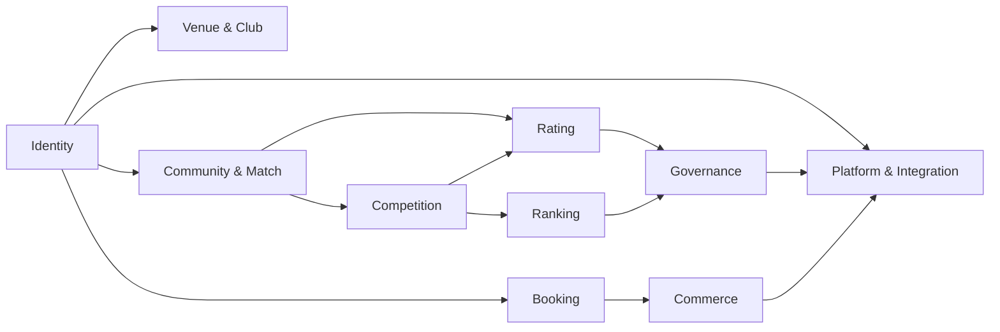

# Domain map

## Ownership rules

- Domain services own business transitions; controllers only translate HTTP.
- Unified Match is the competitive read/write boundary for all sources.
- Rating reads official result versions and writes immutable transactions.
- Ranking reads competition outcomes/point transactions, never current rating as a substitute.
- Tenant operations and platform network data use separate policy checks.
- Public API returns projections, not ORM rows or financial records.

## Suggested code boundary

Until a full namespace move is approved, existing `app/Services`, `app/Models`, `app/Controllers` remain the runtime boundary. New code should use domain-prefixed services and contracts; move files only with tests and compatibility adapters.
